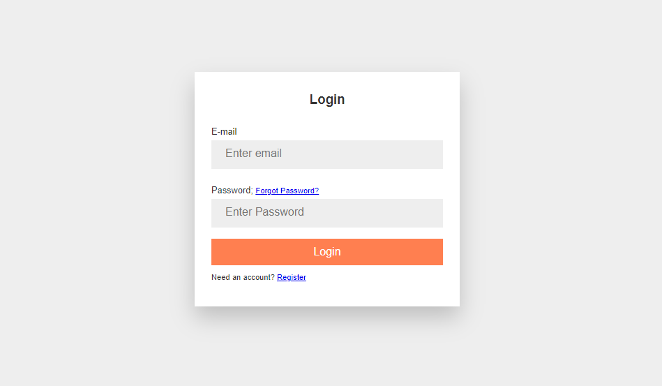

# M.E.R.N Authentication

M.E.R.N Authentication is a project focused on doing authentication using the M.E.R.N. stack.
This project features a React application, an ExpressJS API with JSON web tokens and a MongoDb database.
M.E.R.N. = Mongo Db, ExpressJs, React and NodeJs

## Build Steps ⚙

This project was built with NodeJs -v 14.xx. Packages used includes:

Server:

    1. bcryptjs ^2.4.3
    2. dotenv ^10.0.0,
    3. express ^4.17.1,
    4. jsonwebtoken ^8.5.1,
    5. mongoose ^5.13.5,
    6. nodemailer ^6.6.3
    
Client:

    1. axios ^0.21.1
    2. react ^17.0.2
    3. react-dom ^17.0.2
    4. react-router-dom ^5.2.0
    5. react-scripts 4.0.3
    

Running Locally 🖥️
1. Clone repo using the following command:
    ```shell script
    git clone https://github.com/Itsyaboikris/M.E.R.N.-Authentication.git 
    ```
2. cd in project server
4. Install server dependencies
    ```shell script
    npm install
    ```
5. Run Server 🎉
    ```shell script
    npm run dev
    ```
6. cd in project client
7. Install dependencies
    ```shell script
    npm install
    ```
8. Run project 🎉
    ```shell script
    npm start
    ```


## Project structure 📁

The code for this project can be found in the following files:

- `client`- Client Files
- `server`- Server Files
